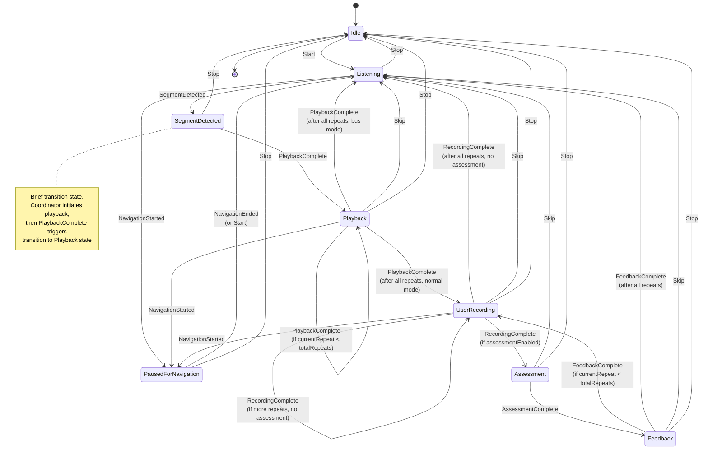
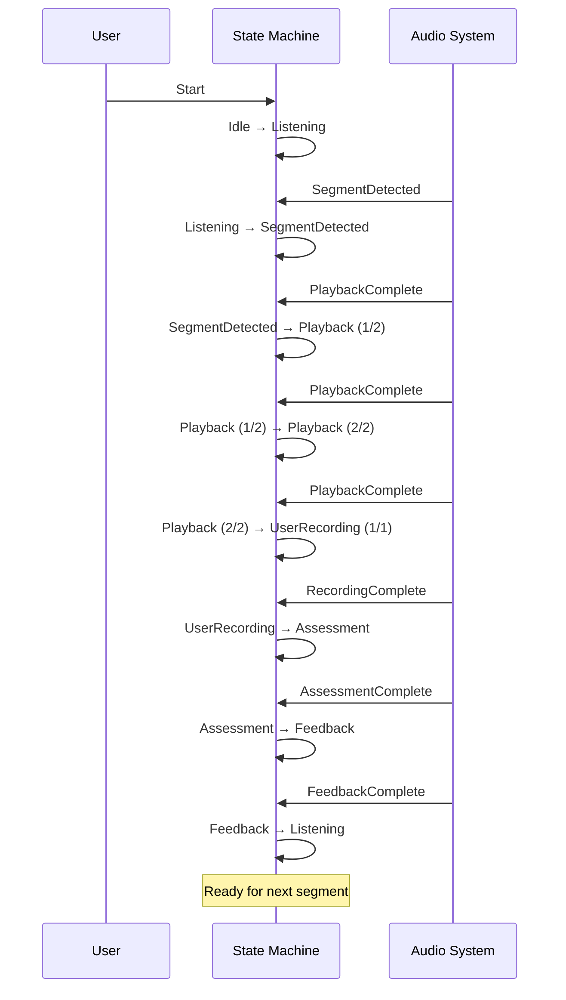
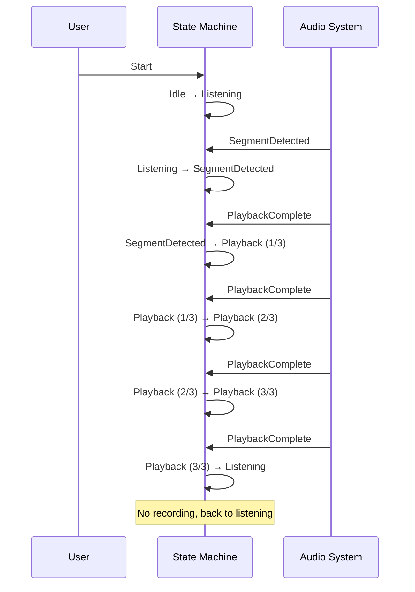
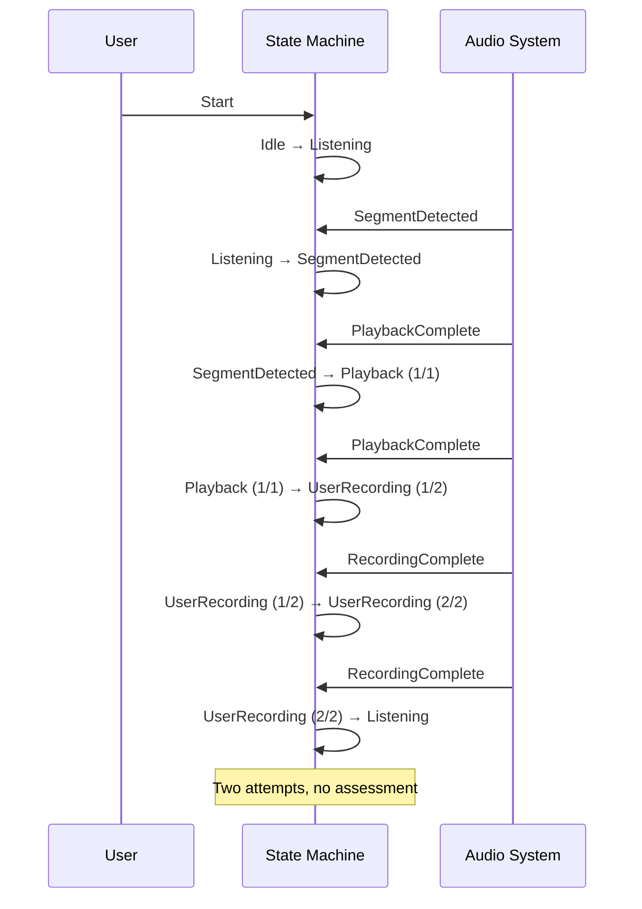
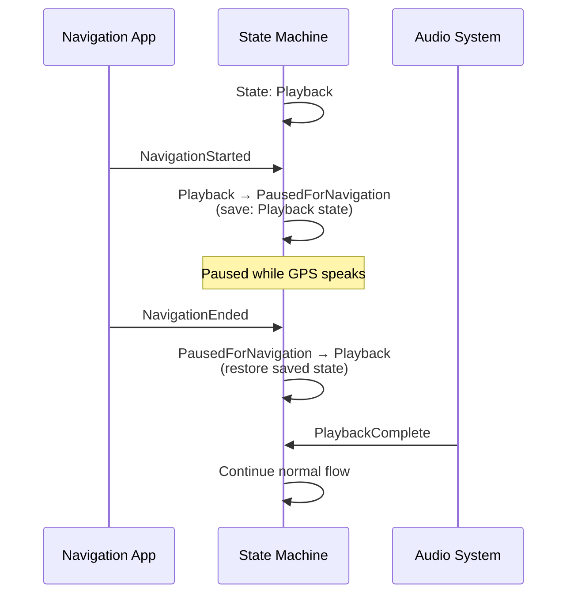
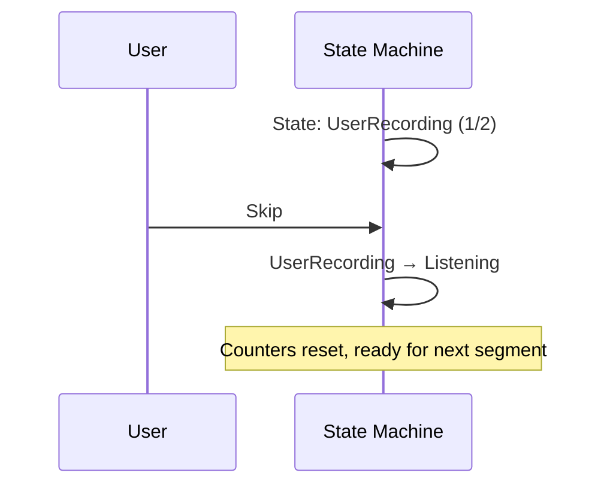

# Shadowing State Machine Diagram

This document provides a visual representation of the shadowing practice state machine and documents common state flows.

## Complete State Machine Diagram

## State Descriptions

### Core States

| State | Description | Duration |
|-------|-------------|----------|
| **Idle** | App ready but not practicing | Indefinite |
| **Listening** | Monitoring audio for speech segments via VAD | Continuous |
| **SegmentDetected** | Speech detected, preparing playback | Brief (~200ms) |
| **Playback** | Playing segment for learner | Segment length / speed |
| **UserRecording** | Recording learner's pronunciation | Until silence detected |
| **Assessment** | Evaluating pronunciation | ~1-2 seconds |
| **Feedback** | Showing assessment results | ~2-3 seconds |
| **PausedForNavigation** | Paused for GPS/navigation audio | Until navigation ends |

## Common State Flow Examples

### Example 1: Standard Practice Flow (with assessment)

**Configuration:**
- playbackRepeats: 2
- userRepeats: 1
- assessmentEnabled: true
- busMode: false

### Example 2: Bus Mode (Listen-only)

**Configuration:**
- playbackRepeats: 3
- busMode: true (overrides userRepeats and assessmentEnabled)

### Example 3: Multiple User Attempts (no assessment)

**Configuration:**
- playbackRepeats: 1
- userRepeats: 2
- assessmentEnabled: false
- busMode: false

### Example 4: Navigation Interruption

**Note:** Navigation pause preserves the exact state (including repeat counters) for seamless resume.

### Example 5: User Skips Segment

**Note:** Skip is available in Playback, UserRecording, Assessment, and Feedback states.

## Event Trigger Reference

### User-Initiated Events

| Event | How Triggered | Available In |
|-------|--------------|--------------|
| **Start** | User taps Start button | Idle, PausedForNavigation |
| **Stop** | User taps Stop button | All states |
| **Skip** | User taps Skip button | Playback, UserRecording, Assessment, Feedback |

### System-Initiated Events

| Event | How Triggered | Triggered By |
|-------|--------------|--------------|
| **SegmentDetected** | VAD identifies speech segment | AudioProcessingPipeline |
| **PlaybackComplete** | Audio playback finishes | PlaybackEngine |
| **RecordingComplete** | User recording finishes | UserRecordingManager |
| **AssessmentComplete** | Pronunciation scoring done | AssessmentService |
| **FeedbackComplete** | Feedback display timeout | ShadowingCoordinator |
| **NavigationStarted** | Navigation audio detected | NavigationAudioDetector |
| **NavigationEnded** | Navigation audio ends | NavigationAudioDetector |

## Configuration Impact on Flow

### `busMode = true`
- **Skips:** UserRecording, Assessment, Feedback states
- **Flow:** Listening → SegmentDetected → Playback (×N) → Listening

### `assessmentEnabled = false`
- **Skips:** Assessment, Feedback states
- **Flow:** Listening → SegmentDetected → Playback (×N) → UserRecording (×M) → Listening

### `playbackRepeats = 1-5`
- **Controls:** How many times segment plays before user's turn
- **Default:** 1

### `userRepeats = 1-3`
- **Controls:** How many recording attempts per segment
- **Default:** 1
- **Note:** Each attempt with assessment gets individual feedback

### `pauseForNavigation = false`
- **Effect:** NavigationStarted/NavigationEnded events are ignored
- **Flow:** Practice continues uninterrupted even with navigation audio

## State Machine Invariants

1. **Stop always succeeds:** Stop event transitions to Idle from any state
2. **Counter consistency:** Internal counters always match state repeat numbers
3. **Segment preservation:** currentSegment maintained through full cycle until reset
4. **Pause state saved:** stateBeforePause always set when transitioning to PausedForNavigation
5. **Configuration immutability during segment:** Config changes don't affect in-progress segment
6. **Reset on completion:** Counters and tracking reset when returning to Listening

## Implementation Notes

- State transitions are logged with format: `CurrentState -> NewState (event: EventName)`
- Invalid transitions are silently ignored (no state change, no error)
- All state changes are atomic and published via StateFlow
- State machine is thread-safe (single MutableStateFlow as source of truth)
- Events are processed sequentially (no concurrent event handling)

## Related Files

- `ShadowingState.kt` - State and Event definitions with inline documentation
- `ShadowingStateMachine.kt` - State machine implementation with transition logic
- `ShadowingCoordinator.kt` - Orchestrates components based on state changes
- `ShadowingConfig.kt` - Configuration model that influences state transitions
